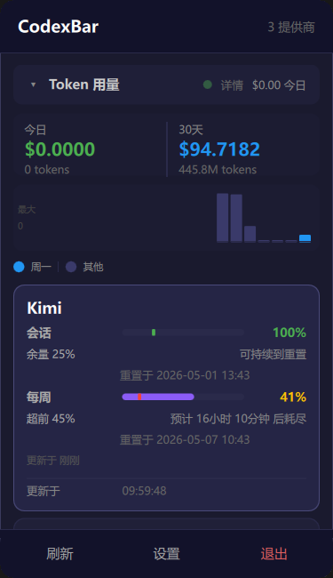
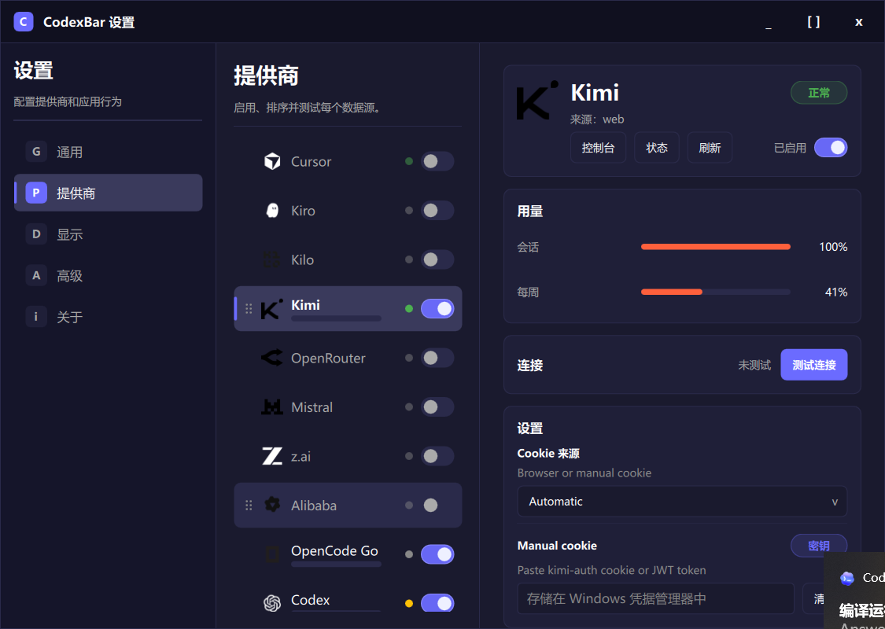

# WinCodexBar

WinCodexBar 是一个 Windows 托盘小工具，用来查看多个 AI 服务的额度、用量和重置时间。它基于 C++、Qt 和 QML 开发，适合把 Codex、Kimi、OpenRouter、z.ai 等常用提供商的状态放在桌面边上随时查看。

## 项目来源与协议

本项目来源于 [CodexBar](https://github.com/steipete/CodexBar)，在其基础上进行 Windows 版本适配和独立维护。原项目和本项目均遵循 MIT 协议。

## 软件截图

### 托盘用量面板



### 提供商设置



## 主要功能

- 在托盘面板中查看今日、30 天、会话和每周用量。
- 支持多个 AI 提供商，并可在设置中启用、停用、排序和测试连接。
- 显示额度进度、预计耗尽时间、重置时间和连接状态。
- 支持深色界面，适合长期常驻桌面使用。

## 环境要求

- Windows 10 1809 或更新版本
- Qt 6.5 或更新版本
- CMake
- Visual Studio C++ Build Tools

## 编译和运行

```powershell
cmake -B build
cmake --build build --config Release
```

编译完成后，程序位于：

```text
build/Release/WinCodexBar.exe
```

双击运行后，WinCodexBar 会出现在 Windows 系统托盘中。

## 测试

```powershell
ctest --test-dir build -C Release --output-on-failure
```

## 说明

本项目是 CodexBar 的 Windows 版本实现，仓库内容已独立维护。`docs/` 目录主要用于开发记录和迁移说明，默认不会全部进入 Git 历史。
